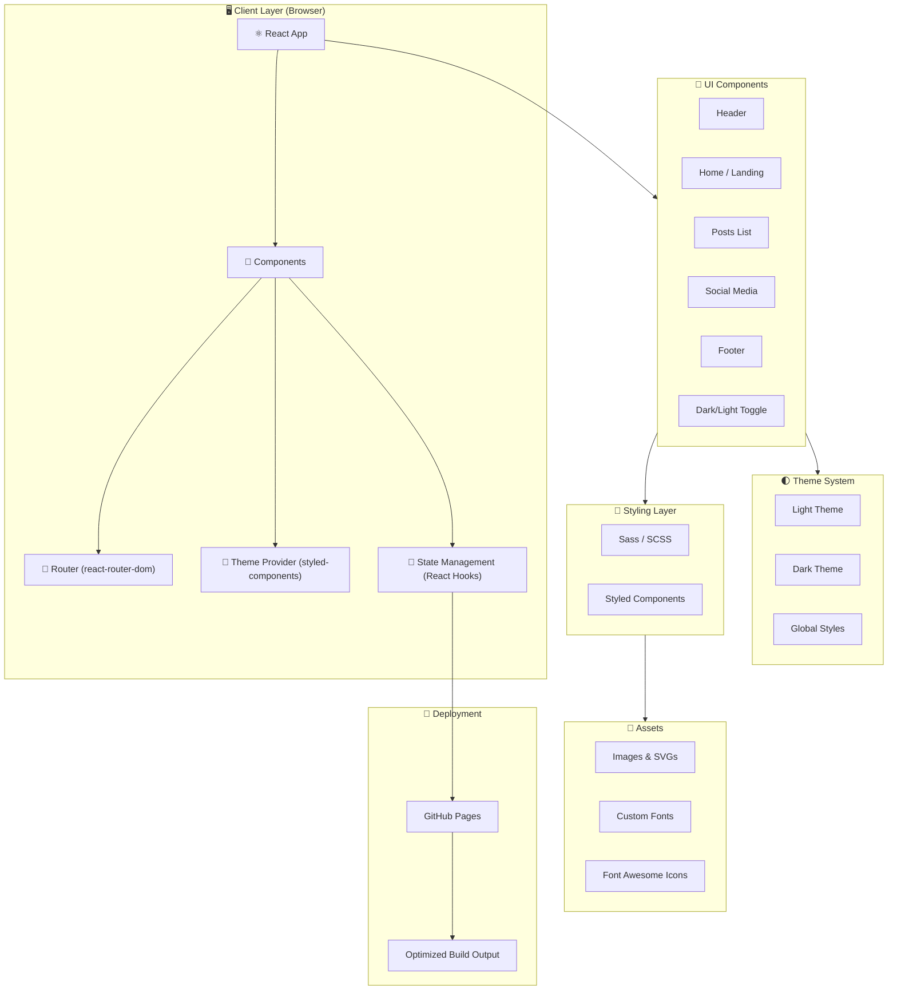
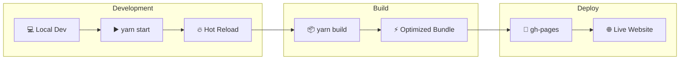

# 🌟 Truvisory - Resources To Learn Anything 🌟

[](http://hits.dwyl.com/ashutosh1919/truvisory)
[](https://img.shields.io/badge/objective-sharing-important)
[](https://img.shields.io/badge/outcome-interaction-blueviolet)
[](https://img.shields.io/badge/sideeffect-inspiration-informational)
[](https://github.com/ashutosh1919/truvisory/blob/master/LICENSE)
[](https://github.com/ashutosh1919/truvisory/stargazers)

> **Truvisory** is an open-source initiative designed to share top-tier learning resources covering a wide array of domains including **Technology, Design, Self Branding, Motivation, and Career Growth**. 
> 
> *Knowledge is the foundation of progress - by sharing it with others, we create a better world.* 🌍

---

## 📑 Table of Contents

- [🚀 System Architecture](#-system-architecture)
- [✨ Key Features](#-key-features)
- [🛠️ Dev Stack](#️-dev-stack)
- [📖 Instructions & Getting Started](#-instructions--getting-started)
- [⚙️ Configurations](#️-configurations)
- [📊 Project Statistics](#-project-statistics)
- [🤝 Contributing](#-contributing)
- [📄 License](#-license)
- [🔗 Helpful Resource Links](#-helpful-resource-links)

---

## 🚀 System Architecture

Below is the **System Architecture** of Truvisory, visually representing the robust React-based frontend structure, UI component flow, and deployment pipeline.



### 🔄 CI/CD & Build Workflow



---

## ✨ Key Features

Truvisory is packed with features focused on user experience and seamless access to content:

- **📚 Comprehensive Resource Library**: Curated, high-quality learning resources covering highly demanded skills.
- **🌓 Dynamic Dark/Light Mode**: Smooth, user-preference-based theme switching configured with `styled-components`.
- **📱 Fully Responsive Design**: Mobile-first architecture ensuring the web app looks gorgeous on any device.
- **🗂️ Intuitive Category Navigation**: Content is cleanly organized into specific domains like **Technology, Design, and Motivation**.
- **🔗 Social Media Integration**: Quick links to connect, collaborate, and share with the broader community.
- **⚡ Fast and Optimized UI**: Built with React's virtual DOM and animated with `react-reveal` for a snappy, interactive experience.

---

## 🛠️ Dev Stack

Built leveraging modern, industry-standard web technologies to ensure scalability, performance, and developer happiness.

### **Frontend Core**
- **[React.js](https://reactjs.org/)** (`^16.13.1`): Component-based UI library.
- **[React Router DOM](https://reactrouter.com/)** (`^5.2.0`): Declarative client-side routing.
- **[Reactstrap](https://reactstrap.github.io/)** (`^8.4.1`): Bootstrap 4 components built for React.

### **Styling & Theming**
- **[Styled Components](https://styled-components.com/)** (`^5.1.1`): CSS-in-JS for scoped and dynamic theming.
- **[Sass](https://sass-lang.com/)** (`^1.32.0`): CSS extension language for advanced UI styling.

### **Animations & Tooling**
- **[React Reveal](https://www.react-reveal.com/)** (`^1.2.2`): High-performance scroll animations.
- **[Create React App](https://create-react-app.dev/)**: Robust build setup and project scaffolding.
- **[gh-pages](https://www.npmjs.com/package/gh-pages)**: Seamless branch deployment for GitHub Pages.

---

## 📖 Instructions & Getting Started

Follow these **detailed instructions** to get the project up and running locally.

### 📋 Prerequisites
Ensure you have the following installed on your machine:
- **Node.js** (v12+ recommended)
- **Yarn** or **npm** (Yarn is preferred for this project)
- **Git**

### 💻 Installation

1. **Clone the repository:**
   ```bash
   git clone https://github.com/ashutosh1919/truvisory.git
   cd truvisory
   ```

2. **Install dependencies:**
   ```bash
   yarn install
   # OR
   npm install
   ```

3. **Start the development server:**
   ```bash
   yarn start
   ```
   > *The app will automatically launch in your default browser at `http://localhost:3000` with hot-reloading enabled.*

### 🛠️ Available Scripts
- `yarn start`: Runs the app in development mode.
- `yarn build`: Builds the app for production into the `build` folder.
- `yarn test`: Launches the test runner in interactive watch mode.
- `yarn deploy`: Builds the application and pushes it to the `gh-pages` branch.

---

## ⚙️ Configurations

To customize Truvisory for your own use, you can configure several core files:

### 1️⃣ **Theme Configuration** (`src/theme.js`)
You can tweak the primary colors, secondary colors, and background hex codes to personalize your Light and Dark modes.
```javascript
export const lightTheme = {
  body: '#FFF',
  text: '#363537',
  toggleBorder: '#FFF',
  background: '#363537',
}
export const darkTheme = {
  body: '#363537',
  text: '#FAFAFA',
  toggleBorder: '#6B8096',
  background: '#999',
}
```

### 2️⃣ **Homepage & Deployment** (`package.json`)
Before deploying, make sure to update the `"homepage"` key to point to your GitHub Pages URL:
```json
{
  "homepage": "https://<your-username>.github.io/<your-repo-name>/"
}
```

### 3️⃣ **Environment Variables**
Create a `.env` file at the root to configure custom titles or keys if you decide to extend the project:
```env
REACT_APP_TITLE=Truvisory Custom
```

---

## 📊 Project Statistics

Here are some highlighted metrics showcasing the scale and impact of the project:

- **100+** Curated LinkedIn Resource Posts
- **15+** Reusable React Components
- **6** Major Content Categories (Technology, Design, Self Branding, Career, Open Source, Motivation)
- **100% Free** and Open Source (MIT Licensed)
- **Cross-Browser Compatible**: Supported on Chrome, Firefox, Safari, and Edge.

---

## 🤝 Contributing

We ❤️ contributions! Whether it's a bug fix, a new feature, or adding an awesome new resource link, your help is appreciated.

1. **Fork** the repository.
2. **Clone** your forked repository.
3. Create a **feature branch**: `git checkout -b feature/AmazingFeature`
4. **Commit** your changes: `git commit -m 'Add some AmazingFeature'`
5. **Push** to the branch: `git push origin feature/AmazingFeature`
6. Open a **Pull Request**.

> *Please ensure you read our `Contributing.md` for detailed guidelines before submitting your PR.*

---

## 📄 License

This project is licensed under the **MIT License**. See the [LICENSE](LICENSE) file for more information.

---

## 🔗 Helpful Resource Links

Explore some of our most popular curated resources:

- 💻 **Tech:** [Best resources to learn ML/DL and Data Science](https://www.linkedin.com/posts/ashutosh-hathidara-88710b138_mlfyworld-datascience-deeplearning-activity-6657887148286533632-6nBn)
- ☁️ **Cloud:** [Best resources to learn cloud architecture and computing](https://www.linkedin.com/posts/ashutosh-hathidara-88710b138_mlfyworld-cloud-knowledge-activity-6666189626375495680-Rc4p)
- 🎨 **Design:** [Best resources to learn UI/Front end Design](https://www.linkedin.com/posts/ashutosh-hathidara-88710b138_mlfyworld-designprinciples-ui-activity-6662611269973090304-LpdL)
- 📈 **Career:** [Start to end procedure to get admit for MS in USA](https://www.linkedin.com/posts/ashutosh-hathidara-88710b138_mlfyworld-msinusa-knowledge-activity-6670888411349565440-h3aR)
- 🧠 **Motivation:** [4 Golden Rules to push your work efficiency and lifestyle](https://www.linkedin.com/posts/ashutosh-hathidara-88710b138_mlfyworld-motivation-inspiration-activity-6685395886412984320-2UBT)

---

*Crafted with ❤️ by [Ashutosh Hathidara](https://www.linkedin.com/in/ashutosh-hathidara-88710b138/)*
