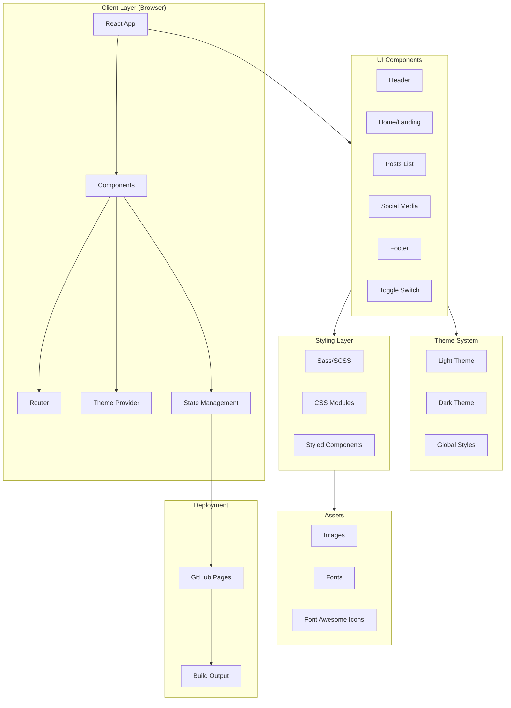
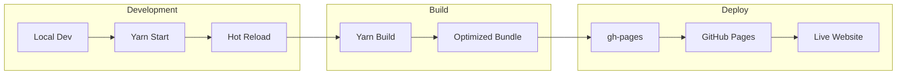
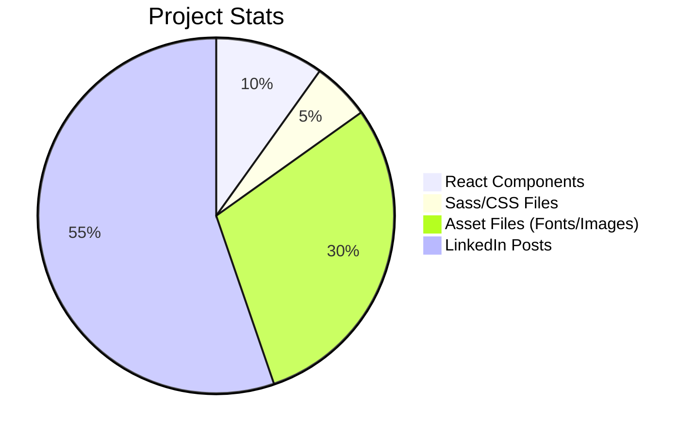

# Truvisory (Resources To Learn Anything)

[](http://hits.dwyl.com/ashutosh1919/truvisory)
[](https://img.shields.io/badge/objective-sharing-important)
[](https://img.shields.io/badge/outcome-interaction-blueviolet)
[](https://img.shields.io/badge/sideeffect-inspiration-informational)
[](https://github.com/ashutosh1919/truvisory/blob/master/LICENSE)
[](https://github.com/ashutosh1919/truvisory/stargazers)
[](https://github.com/ashutosh1919/truvisory/network/members)

> **Truvisory** is an initiative to share learning resources for new Technology, Design, Self Branding, Motivation and more. Knowledge is the foundation of progress - by sharing it with others, we create a better world.

---

## Table of Contents

- [System Architecture](#system-architecture)
- [Features](#features)
- [Tech Stack](#tech-stack)
- [Getting Started](#getting-started)
- [Installation](#installation)
- [Configuration](#configuration)
- [Available Scripts](#available-scripts)
- [Project Statistics](#project-statistics)
- [Contributing](#contributing)
- [License](#license)
- [Links to LinkedIn Posts](#links-to-linkedin-posts)

---

## System Architecture





---

## Features

### Core Features

- **Comprehensive Resource Library** - Curated learning resources across multiple domains
- **Dark/Light Mode Toggle** - User preference for theme switching
- **Responsive Design** - Mobile-first approach with cross-device compatibility
- **Category-based Navigation** - Organized content by technology, design, and personal development
- **Social Media Integration** - Connect with the creator on LinkedIn and other platforms

### Content Categories

| Category | Description |
|----------|-------------|
| **Technology** | Programming, ML/DL, Data Science, Web Dev, Cloud, DevOps |
| **Design** | UI/UX, Frontend Design, Illustration Tools |
| **Self Branding** | LinkedIn Optimization, Personal Growth, Career Advice |
| **Motivation** | Learning Journey, Success Stories, Productivity Tips |
| **Career** | Interview Prep, Job Search, MS Admission |

### Key Highlights

- **100+ LinkedIn Posts** - Extensive collection of curated learning resources
- **Free Resources** - All content is freely accessible
- **Open Source** - Community-driven contributions welcome
- **Regular Updates** - Fresh content added regularly

---

## Tech Stack

### Frontend

| Technology | Version | Purpose |
|------------|---------|---------|
| **React** | ^16.13.1 | Core UI Framework |
| **React Router** | ^5.2.0 | Client-side routing |
| **Reactstrap** | ^8.4.1 | Bootstrap React components |
| **Styled Components** | ^5.1.1 | CSS-in-JS styling |
| **Node Sass** | ^4.14.1 | SCSS compilation |

### Animation & Effects

| Package | Purpose |
|---------|---------|
| **React Reveal** | Scroll animations and reveals |

### Development Tools

| Tool | Purpose |
|------|---------|
| **Create React App** | Project scaffolding |
| **ESLint** | Code linting |
| **Gh-pages** | GitHub Pages deployment |

### Browser Support

- Chrome (latest)
- Firefox (latest)
- Safari (latest)
- Edge (latest)

---

## Getting Started

### Prerequisites

Before you begin, ensure you have the following installed:

- **Node.js** (v12 or higher recommended)
- **npm** or **yarn** package manager
- **Git** for version control

### System Requirements

| Requirement | Minimum |
|-------------|---------|
| OS | Windows, macOS, Linux |
| RAM | 4GB |
| Disk Space | 500MB |

---

## Installation

### 1. Clone the Repository

```bash
git clone https://github.com/girishlade111/truvisory.git
cd truvisory
```

### 2. Install Dependencies

Using **yarn** (recommended):

```bash
yarn install
```

Or using **npm**:

```bash
npm install
```

### 3. Start Development Server

```bash
yarn start
```

The application will open at [http://localhost:3000](http://localhost:3000).

### 4. Build for Production

```bash
yarn build
```

### 5. Deploy to GitHub Pages

```bash
yarn deploy
```

---

## Configuration

### Environment Variables

Create a `.env` file in the root directory:

```env
REACT_APP_TITLE=Truvisory
REACT_APP_DESCRIPTION=Resources To Learn Anything
REACT_APP_AUTHOR=Ashutosh Hathidara
```

### Theme Configuration

Edit `src/theme.js` to customize colors and styling:

```javascript
export const theme = {
  colors: {
    primary: '#007bff',
    secondary: '#6c757d',
    // ... more colors
  },
  fonts: {
    main: 'Montserrat, sans-serif',
    secondary: 'Gilroy, sans-serif',
  },
};
```

### Homepage URL

Update in `package.json`:

```json
{
  "homepage": "https://your-username.github.io/truvisory/"
}
```

---

## Available Scripts

| Command | Description |
|---------|-------------|
| `yarn start` | Start development server with hot reload |
| `yarn build` | Build production-ready bundle |
| `yarn deploy` | Deploy to GitHub Pages |
| `yarn test` | Run tests |
| `yarn eject` | Eject from Create React App |

---

## Project Statistics



### Key Metrics

- **Total Components**: 15+
- **Content Posts**: 84+
- **Categories**: 6 major categories
- **Theme Support**: Light & Dark mode
- **License**: MIT

---

## Contributing

We welcome contributions! Please follow these steps:

### 1. Fork the Repository

Click the "Fork" button on the top right of this page.

### 2. Clone Your Fork

```bash
git clone https://github.com/YOUR_USERNAME/truvisory.git
cd truvisory
```

### 3. Create a Branch

```bash
git checkout -b feature/your-feature-name
```

### 4. Make Changes

Edit the files and make your improvements.

### 5. Commit Changes

```bash
git add .
git commit -m "Add your descriptive commit message"
```

### 6. Push to GitHub

```bash
git push origin feature/your-feature-name
```

### 7. Create Pull Request

Open a pull request on the original repository.

### Contribution Guidelines

- Follow the existing code style and conventions
- Write meaningful commit messages
- Test your changes before submitting
- Update documentation if needed

Please read the full guidelines in [Contributing.md](/Contributing.md).

---

## License

This project is licensed under the **MIT License** - see the [LICENSE](LICENSE) file for details.

---

## Links to LinkedIn Posts

### Technology

- [How much impact competitive coding has on career of a college student?](https://www.linkedin.com/posts/ashutosh-hathidara-88710b138_mlfyworld-coding-competitiveprogramming-activity-6656426517767249920-T5eO)
- [What is the best way to learn ML/DL and Data Science for free?](https://www.linkedin.com/posts/ashutosh-hathidara-88710b138_mlfyworld-datascience-deeplearning-activity-6657887148286533632-6nBn)
- [What are the best resources to prepare for SDE interviews?](https://www.linkedin.com/posts/ashutosh-hathidara-88710b138_mlfyworld-interviewpreparation-softwareengineers-activity-6659720998260211712-V6Rk)
- [What are the best resources to learn Full Stack Development?](https://www.linkedin.com/posts/ashutosh-hathidara-88710b138_mlfyworld-webdevelopement-knowledge-activity-6661526096338661377-8toV)
- [What are the best resources to learn Docker and Kubernetes?](https://www.linkedin.com/posts/ashutosh-hathidara-88710b138_mlfyworld-docker-kubernetes-activity-6665816662740209664-e9vW)
- [What are the best resources to learn cloud architecture and computing?](https://www.linkedin.com/posts/ashutosh-hathidara-88710b138_mlfyworld-cloud-knowledge-activity-6666189626375495680-Rc4p)
- [What are the best resources to learn git, workflows, actions and APIs?](https://www.linkedin.com/posts/ashutosh-hathidara-88710b138_mlfyworld-github-devops-activity-6666914324151435264-TCuU)
- [What are some of the best resources for Competitive Programming?](https://www.linkedin.com/posts/ashutosh-hathidara-88710b138_mlfyworld-competitiveprogramming-coding-activity-6667266378749345792-4fBc)
- [What are the best resources to learn and implement blockchain applications?](https://www.linkedin.com/posts/ashutosh-hathidara-88710b138_mlfyworld-blockchain-bitcoin-activity-6667637123891519488-KdhQ)
- [What are the resources to learn Android Application Development?](https://www.linkedin.com/posts/ashutosh-hathidara-88710b138_mlfyworld-java-kotlin-activity-6667988724753817600-2byB)
- [What are the best resources to learn iOS Application Development?](https://www.linkedin.com/posts/ashutosh-hathidara-88710b138_mlfyworld-iosdevelopment-mobileappdevelopment-activity-6668347175740821504-ldG9)
- [What are the best resources to learn Flutter App Development?](https://www.linkedin.com/posts/ashutosh-hathidara-88710b138_mlfyworld-flutter-mobileappdevelopment-activity-6669813566624927744-ejbz)
- [What are some of the best libraries to build end-to-end deep learning projects?](https://www.linkedin.com/posts/ashutosh-hathidara-88710b138_mlfyworld-deeplearning-machinelearning-activity-6671616162394206208-tB5C)
- [What are the most trending Databases that you should know about?](https://www.linkedin.com/posts/ashutosh-hathidara-88710b138_mlfyworld-aws-devops-activity-6673055925697413122-nhoK)
- [What are some of the resources to learn Natural Language Processing?](https://www.linkedin.com/posts/ashutosh-hathidara-88710b138_datascience-deeplearning-machinelearning-activity-6673420891508084736-Mof1)
- [What are some of the resources to learn Computer Vision?](https://www.linkedin.com/posts/ashutosh-hathidara-88710b138_mlfyworld-deeplearning-datascience-activity-6673794119325888513-2hTF)
- [What are some good resources to learn backend development in Python?](https://www.linkedin.com/posts/ashutosh-hathidara-88710b138_mlfyworld-python-backend-activity-6674515408017596416-qbR9)
- [What are the best resources to learn backend in NodeJS?](https://www.linkedin.com/posts/ashutosh-hathidara-88710b138_mlfyworld-backend-nodejs-activity-6674872076324741120-KT5x)
- [What are the best resources to learn Devops?](https://www.linkedin.com/posts/ashutosh-hathidara-88710b138_mlfyworld-devops-aws-activity-6675243387395862528-2RJj)
- [What are the best resources to learn Advanced Python?](https://www.linkedin.com/posts/ashutosh-hathidara-88710b138_mlfyworld-python-knwoledge-activity-6675949741563543553-nGuA)
- [What are the resources to learn Reinforcement Learning?](https://www.linkedin.com/posts/ashutosh-hathidara-88710b138_mlfyworld-datascience-machinelearning-activity-6676383781752061952-SvCu)
- [What are the best resources to learn Google Anthos?](https://www.linkedin.com/posts/ashutosh-hathidara-88710b138_mlfyworld-cloud-anthos-activity-6681399608175812608-YoXg)
- [What are some of the best resources to learn Game Development?](https://www.linkedin.com/posts/ashutosh-hathidara-88710b138_mlfyworld-gamedevelopment-games-activity-6682231681690157056-gT13)
- [What are some of the resources to learn Time Series Analysis and Forecasting?](https://www.linkedin.com/posts/ashutosh-hathidara-88710b138_mlfyworld-datascience-machinelearning-activity-6682852185367179264-l_gT)
- [What are some of the resources to learn Cyber Security?](https://www.linkedin.com/posts/ashutosh-hathidara-88710b138_cybersecurity-mlfyworld-hacking-activity-6683202007962013696-JRVZ)
- [What are some of the resources to learn R?](https://www.linkedin.com/posts/ashutosh-hathidara-88710b138_mlfyworld-datascience-r-activity-6683564750045085696-y9WY)
- [What are some resources to learn Database Management Systems?](https://www.linkedin.com/posts/ashutosh-hathidara-88710b138_mlfyworld-database-dbms-activity-6684652597049102337-M6OV)
- [What are the resources to learn Hadoop?](https://www.linkedin.com/posts/ashutosh-hathidara-88710b138_mlfyworld-hadoop-hdfs-activity-6686833036878721024-GlYv)
- [What are the top resources to learn MongoDB?](https://www.linkedin.com/posts/ashutosh-hathidara-88710b138_mlfyworld-mongodb-database-activity-6687195103078965248-VvU7)
- [What are the resources to learn System Design?](https://www.linkedin.com/posts/ashutosh-hathidara-88710b138_mlfyworld-design-systems-activity-6688998601139466240-31sd)
- [What are the resources to learn Ethical Hacking?](https://www.linkedin.com/posts/ashutosh-hathidara-88710b138_mlfyworld-hacking-security-activity-6689371789685997568-xLg9)
- [What are some resources to learn Spring Boot?](https://www.linkedin.com/posts/ashutosh-hathidara-88710b138_mlfyworld-java-spring-activity-6686466652399251456-RH-z)
- [What are the best resources to learn Digital marketing?](https://www.linkedin.com/posts/ashutosh-hathidara-88710b138_mlfyworld-marketing-growthhacker-activity-6686113764091150336-g_wc)

### Design

- [What are the best resources to learn UI/Front end Design?](https://www.linkedin.com/posts/ashutosh-hathidara-88710b138_mlfyworld-designprinciples-ui-activity-6662611269973090304-LpdL)
- [What are the resources to generate/modify design illustrations?](https://www.linkedin.com/posts/ashutosh-hathidara-88710b138_mlfyworld-design-inkscape-activity-6672693290510508032-8itO)
- [Some amazing npm packages for React JS for better designing and animations](https://www.linkedin.com/posts/ashutosh-hathidara-88710b138_mlfyworld-design-animation-activity-6681757093172658176-oQp4)
- [Some of the amazing new additions in Bootstrap 5](https://www.linkedin.com/posts/ashutosh-hathidara-88710b138_bootstrap-5-whats-new-about-it-and-release-activity-6680474284290281472-w8eE)

### Self Branding & Career

- [What is the correct way of self-branding on LinkedIn?](https://www.linkedin.com/posts/ashutosh-hathidara-88710b138_mlfyworld-growthhacker-selfgrowth-activity-6663776294217625601-uDeg)
- [How to build a great LinkedIn profile?](https://www.linkedin.com/posts/ashutosh-hathidara-88710b138_mlfyworld-linkedinprofile-growthhacker-activity-6665126975759360000-kKUu)
- [What is the best way to write a post on LinkedIn?](https://www.linkedin.com/posts/ashutosh-hathidara-88710b138_mlfyworld-linkedin-growthhacker-activity-6665468554944618496-BNDA)
- [Some more tips on LinkedIn Self-Branding](https://www.linkedin.com/posts/ashutosh-hathidara-88710b138_mlfyworld-knowledge-growthhacker-activity-6677420489503399936-EuEl)
- [How to get a job during/after this pandemic for SDE positions?](https://www.linkedin.com/posts/ashutosh-hathidara-88710b138_mlfyworld-jobposition-growthhacker-activity-6664079714174545920-A1WG)
- [What are the most authentic platforms to apply for jobs?](https://www.linkedin.com/posts/ashutosh-hathidara-88710b138_what-are-the-most-authentic-platforms-to-activity-6669098363998343169-aFAq)
- [Start to end procedure to get admit from University for MS in USA](https://www.linkedin.com/posts/ashutosh-hathidara-88710b138_mlfyworld-msinusa-knowledge-activity-6670888411349565440-h3aR)
- [My professional journey from nothing to MS at University of Southern California](https://www.linkedin.com/posts/ashutosh-hathidara-88710b138_mlfyworld-learningjourney-knowledge-activity-6666568458400075776-a4Dy)
- [My Quora answers have crossed 100,000 views today](https://www.linkedin.com/posts/ashutosh-hathidara-88710b138_mlfyworld-selfbranding-growthhacker-activity-6684653940761485312-86Qy)

### Open Source

- [Why I invest 80% of my time working on opensource projects](https://www.linkedin.com/posts/ashutosh-hathidara-88710b138_mlfyworld-opensource-community-activity-6660079461628805120-QmRK)
- [What are the best resources to get started with Opensource contributions?](https://www.linkedin.com/posts/ashutosh-hathidara-88710b138_mlfyworld-opensource-knowledge-activity-6661130204607578113-yVtu)
- [How to build a significant reputation in opensource communities?](https://www.linkedin.com/posts/ashutosh-hathidara-88710b138_mlfyworld-microsoftstudentpartner-dsc-activity-6664757618667597824-GSHs)
- [Learn Introduction to Git and Opensource](https://www.linkedin.com/posts/ashutosh-hathidara-88710b138_demystifying-it-with-seniors-webinar-activity-6682510098771800064-0M1t)

### Motivation & Personal Growth

- [What is the secret source of motivation for me?](https://www.linkedin.com/posts/ashutosh-hathidara-88710b138_mlfyworld-creativity-motivation-activity-6658244235231326208-W6wh)
- [Is it better to learn many technologies? If yes, how?](https://www.linkedin.com/posts/ashutosh-hathidara-88710b138_mlfyworld-technolgy-knowledge-activity-6658645629524340736-CSI2)
- [What are the most trending technologies one must learn to grow career significantly?](https://www.linkedin.com/posts/ashutosh-hathidara-88710b138_mlfyworld-ai-deeplearning-activity-6664385676605304832-XuZI)
- [What is the easiest way to get job at Google?](https://www.linkedin.com/posts/ashutosh-hathidara-88710b138_mlfyworld-google-knowledge-activity-6660136730924064768-BXC5)
- [Pro-tips on maintaining healthy mentality](https://www.linkedin.com/posts/ashutosh-hathidara-88710b138_mlfyworld-knowledge-motivation-activity-6679392876478177280-6QJx)
- [4 Golden Rules to push your work efficiency and lifestyle](https://www.linkedin.com/posts/ashutosh-hathidara-88710b138_mlfyworld-motivation-inspiration-activity-6685395886412984320-2UBT)
- [What are some of the best books you must read for personal growth?](https://www.linkedin.com/posts/ashutosh-hathidara-88710b138_mlfyworld-knowledge-book-activity-6670180112836763648-g1IH)

### Specialized Topics

- [What are the best resources to prepare for ML/Data Science Interviews?](https://www.linkedin.com/posts/ashutosh-hathidara-88710b138_mlfyworld-machinelearning-deeplearning-activity-6662225600863965185-f1Ol)
- [What are the best resources to learn to make Chatbots?](https://www.linkedin.com/posts/ashutosh-hathidara-88710b138_mlfyworld-chabot-machinelearning-activity-6680669183530827776-lwwF)
- [What are the resources to learn building Recommendation Engine?](https://www.linkedin.com/posts/ashutosh-hathidara-88710b138_mlfyworld-datascience-machinelearning-activity-6681042346378838016-l5TQ)
- [Do you want to start working on Docker for your Machine Learning and Data Science projects?](https://www.linkedin.com/posts/ashutosh-hathidara-88710b138_mlfyworld-datascience-docker-activity-6676810476376113153-tteu)
- [Video editing softwares](https://www.linkedin.com/posts/ashutosh-hathidara-88710b138_mlfyworld-edit-youtube-activity-6689736257226076160-Qyrz)
- [What is your opinion on YouTube vs TikTok?](https://www.linkedin.com/posts/ashutosh-hathidara-88710b138_mlfyworld-youtube-tiktok-activity-6667746807675789312-JZH2)

---

## Support

If you find this project helpful, please consider:

- **Starring** the repository
- **Sharing** with your network
- **Contributing** to the project

---

## Contact

- **LinkedIn**: [Ashutosh Hathidara](https://www.linkedin.com/in/ashutosh-hathidara-88710b138/)
- **Website**: [Truvisory](https://ashutosh1919.github.io/truvisory)

---

> *"Knowledge is the foundation of progress. Let's create a better world by sharing knowledge."*